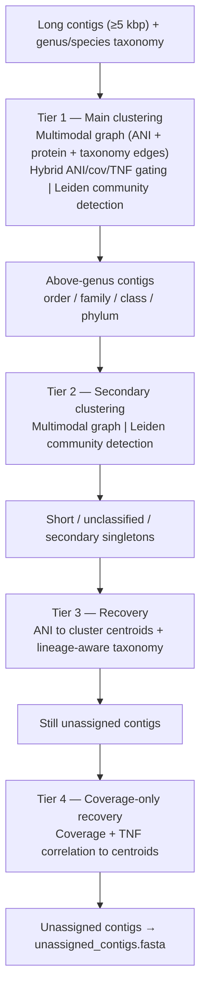

# TriTanc
Taxonomy, ANI and coverage aware metagenomic sequence binner

# Metagenomic Contig Clustering Pipeline

A taxonomy-aware metagenomic contig clustering pipeline that integrates
ANI (Average Nucleotide Identity), coverage correlation, tetranucleotide frequency (TNF),
protein similarity, and taxonomic classification to bin assembled contigs into
high-quality genomic clusters.

# Motivation

Metagenomic binning involves processing and grouping the assembled contigs into
genome bins, and forms a foundational step in creating a metagenome-assembled-genomes (MAGs).
Established tools such as MetaBAT2, MaxBin2, VAMB, SemiBin2, and COMEBin predominantly rely
on two signals: tetranucleotide frequency (TNF) as a proxy for sequence composition, and
coverage depth across sequencing samples. While effective, TNF-based similarity can conflate
phylogenetically distinct organisms that share sequence composition biases,
deep learning approaches require sufficient sample sizes to generalize, and taxonomy is generally
ignored entirely or used as a soft-regularization arm.

TriTanc combines five signals: coverage correlation across multiple samples,
taxonomic assignments, average nucleotide identity, tetranucleotide frequency, and protein
similarity. Taxonomic assignment acts as a hard clustering gate, and contigs are co-binned if
they share a genus or finer assignment to ensure evolutionary coherence.
ANI provides direct sequence-level evidence of genomic relatedness, TNF captures sequence
composition, protein similarity bridges divergent contigs that share functional gene content,
and coverage correlation confirms that co-binned contigs share the same ecological dynamics
across samples.

This multi-signal, rule-based architecture is intentionally interpretable: every binning decision
can be traced to explicit thresholds on measurable quantities, with no black-box model weights
or training data required. A hierarchical tiered design (main clustering → secondary clustering →
recovery → coverage-only recovery) maximises contig placement without sacrificing bin purity.

Integrated CheckM2 quality assessment and dRep dereplication ensure that the final output
consists of non-redundant, quality-tiered MAGs ready for downstream pangenomic or ecological analysis.

---

## What's New

- **TNF signal** — canonical RC-collapsed 4-mer frequencies added as a third composition signal; contigs < 1,000 bp are TNF-neutral
- **Protein similarity** — ORFs called with pyrodigal (Prodigal, meta mode), followed by MMseqs2 all-vs-all protein search; protein edges fill gaps where skani ANI is sparse
- **Multimodal graph** (`_build_multimodal_graph`) — Tiers 1/2 now combine ANI edges, protein-similarity edges, and taxonomy edges in priority order; hybrid gating replaces the old hard/soft coverage switch
- **Leiden community detection** — `leidenalg` + `python-igraph` replace naive connected-components; tunable resolution at each tier (`--leiden-res-main`, `--leiden-res-secondary`, `--leiden-res-t4`)
- **Centroid-based coverage** — Tier 3 and recovery use cluster centroids (not single representatives) for more stable coverage correlation
- **Lineage-aware recovery** — taxonomy fallback traverses the full lineage rather than leaf taxon only
- **`--coverage-as-tiebreaker`** — disables the hard coverage gate for low-coverage datasets
- **`--min-af`** — alignment fraction filter for skani pairs
- **`--min-checkm2-bp`** — minimum bin size (bp) for CheckM2 submission
- **Output restructured** — bins in `clusters/bins/`, representatives in `clusters/representatives/`, CheckM2-eligible symlinks in `clusters/thresh_bins/`

---

## Time taken to run the script

For the three inputs, the script can take inputs from pre-computed results, or can run the tools
needed to generate these inputs. For coverage, `jgi_summarize_bam_contig_depths` is used if the BAMs are provided.
For taxonomic information, `mmseqs taxonomy` is run if the relevant input is absent, and
an mmseqs2-compatible database is provided. `skani` is run if needed, and the script will automatically run this.
Time taken for running the different tools here:
`skani` ~ few minutes < `jgi_summarize_bam_contig_depths` ~ go out for a coffee break < `mmseqs taxonomy` ~ go have lunch

Protein similarity (pyrodigal + MMseqs2 protein search) adds ~5–30 min depending on assembly size.
Supply `--prot-sim <file>` to skip if pre-computed, or pass `--skip-prot-sim` to omit entirely.

The script is also compatible with the taxometer results from VAMB.

## How It Works

The pipeline proceeds through the following steps:

1. **Taxonomy assignment** - Runs MMseqs2 Taxonomy against a reference database (e.g., GTDB), or accepts a pre-computed taxonomy file (MMseqs2 or Taxometer format)
2. **ANI calculation** - Runs `skani triangle` (all-vs-all) to compute pairwise ANI between contigs
3. **Protein similarity** - Calls ORFs with pyrodigal then runs MMseqs2 all-vs-all protein search to produce contig-level protein similarity scores 
4. **TNF computation** - Computes canonical RC-collapsed tetranucleotide frequencies for all contigs ≥ 1,000 bp
5. **Depth profiling** - Runs `jgi_summarize_bam_contig_depths` on BAM files to build a per-sample coverage matrix
6. **Tier 1 (main clustering)** - Clusters long contigs (≥ 5,000 bp) assigned at genus/species level using a multimodal graph (ANI + protein + taxonomy edges) with hybrid ANI/coverage/TNF gating; Leiden community detection
7. **Tier 2 (secondary clustering)** - Second-pass multimodal clustering for above-genus assigned contigs (order/family/class/phylum)
8. **Tier 3 (recovery)** - Assigns short and unclassified contigs to existing clusters via ANI hits to cluster centroids and/or shared lineage taxonomy
9. **Tier 4 (coverage-only recovery)** - Places remaining unassigned contigs using coverage + TNF correlation against cluster centroids, without requiring ANI evidence 
10. **Quality assessment** - Runs CheckM2 for completeness/contamination estimates (bins ≥ `--min-checkm2-bp`). I need to combine the quality assessment summary to the clustering summary
11. **Dereplication** - Runs dRep at 95% ANI to produce a non-redundant bin set
12. **Checkpointing** - Saves intermediate results as Parquet/JSON files to allow resuming interrupted runs

---

## Requirements

### Python

Python **3.10+** is required.

### Python Packages

Replace pip with mamba/conda as you wish. I recommend creating a new environment for this.

```bash
pip install numpy pandas networkx biopython scipy statsmodels pyarrow igraph leidenalg
```

| Package | Version | Purpose |
|---|---|---|
| `numpy` | ≥1.23 | Vectorized depth/TNF matrix operations |
| `pandas` | ≥1.5 | Data I/O and manipulation |
| `networkx` | ≥2.8 | Graph construction |
| `biopython` | ≥1.79 | FASTA parsing and writing |
| `scipy` | ≥1.9 | Spearman correlation |
| `statsmodels` | ≥0.13 | BH-FDR multiple testing correction |
| `pyarrow` | ≥10.0 | Parquet checkpointing |
| `igraph` | ≥0.10 | Fast graph backend for Leiden |
| `leidenalg` | ≥0.10 | Leiden community detection |

### External Tools

Install via conda (recommended):

```bash
mamba install -c bioconda mmseqs2 skani metabat2 samtools checkm2 drep vamb pyrodigal
```

| Tool | Required When | Source |
|---|---|---|
| `mmseqs` | `--taxonomy` not provided, or protein similarity step | [MMseqs2](https://github.com/soedinglab/MMseqs2) |
| `skani` | `--ani` not provided | [skani](https://github.com/bluenote-1577/skani) |
| `pyrodigal` | `--prot-sim` not provided and `--skip-prot-sim` not set | [pyrodigal](https://github.com/althonos/pyrodigal) |
| `jgi_summarize_bam_contig_depths` | `--depth` not provided | Part of MetaBAT2 |
| `samtools` | `--depth` not provided | [HTSlib](https://www.htslib.org) |
| `checkm2` | `--skip-checkm2` not set | [CheckM2](https://github.com/chklovski/CheckM2) |
| `dRep` | `--skip-drep` not set | [dRep](https://github.com/MrOlm/drep) |

---

## Usage

### Fully Automatic (minimum inputs)

```bash
python tritanc_v10.py \
  --fasta assembly.fasta \
  --bams sample1.bam sample2.bam sample3.bam \
  --mmseqs-db /path/to/GTDB \
  --outdir results/
```

### Skip Individual Steps with Pre-computed Files

```bash
python tritanc_v10.py \
  --fasta assembly.fasta \
  --taxonomy saliva_tax.tsv \
  --taxonomy-format taxometer \
  --ani skani.tsv \
  --prot-sim prot_sim.tsv \
  --depth depth_matrix.txt \
  --outdir results/
```

### Skip Protein Similarity (faster, slightly lower recovery)

```bash
python tritanc_v10.py \
  --fasta assembly.fasta \
  --taxonomy saliva_tax.tsv \
  --ani skani.tsv \
  --depth depth_matrix.txt \
  --skip-prot-sim \
  --outdir results/
```

### Low-Coverage Datasets (disable hard coverage gate)

```bash
python tritanc_v10.py \
  --fasta assembly.fasta \
  --bams sample*.bam \
  --mmseqs-db /path/to/GTDB \
  --coverage-as-tiebreaker \
  --outdir results/
```

---

## Arguments

### Required

| Argument | Description |
|---|---|
| `--fasta` | Assembly FASTA file containing all contigs |
| `--outdir` | Output directory |

### Step-skipping Inputs

Supplying these pre-computed files skips the corresponding pipeline step:

| Argument | Skips |
|---|---|
| `--taxonomy` | MMseqs2 taxonomy run |
| `--ani` | skani triangle run |
| `--prot-sim` | pyrodigal + MMseqs2 protein similarity run |
| `--depth` | jgi depth profiling step |

### Conditionally Required

| Argument | Required When |
|---|---|
| `--bams` | `--depth` is not supplied |
| `--mmseqs-db` | `--taxonomy` is not supplied |

### Tunable Parameters

| Argument | Default | Description |
|---|---|---|
| `--threads` | `8` | Threads for MMseqs2, skani, and pyrodigal |
| `--min-len` | `5000` | Min contig length (bp) for main clustering |
| `--ani-threshold` | `95.0` | ANI (%) threshold; adaptive override |
| `--cov-threshold` | _adaptive_ | Spearman r threshold; overrides all tiers |
| `--min-af` | `0.0` | Min skani alignment fraction (0 = disabled) |
| `--coverage-as-tiebreaker` | off | Disable hard coverage gate globally |
| `--tnf-gate-main` | `0.85` | Min TNF cosine similarity for hybrid gating in Tiers 1/2 |
| `--min-score` | `0.0` | Taxometer min per-level confidence score (0–1) |
| `--taxonomy-format` | `mmseqs2` | Taxonomy file format: `mmseqs2` or `taxometer` |
| `--min-prot-sim` | `50.0` | Min protein identity (%) to retain a hit |

### Leiden Resolution

| Argument | Default | Description |
|---|---|---|
| `--leiden-res-main` | `1.3` | Leiden resolution for Tier 1 (main clustering) |
| `--leiden-res-secondary` | `0.8` | Leiden resolution for Tier 2 (secondary clustering) |
| `--leiden-res-t4` | `0.8` | Leiden resolution for Tier 4 (coverage-only recovery) |

Prefer main resolution as 3.5, secondary as 2.0, tier 4 recovery as 1.5 if the bins formed are too huge for splitting

### Recovery

| Argument | Default | Description |
|---|---|---|
| `--skip-cov-recovery` | off | Skip Tier 4 coverage-only recovery |
| `--cov-recovery-r` | `0.80` | Min Spearman r for Tier 4 |
| `--cov-recovery-tnf-min` | `0.90` | Min TNF cosine similarity for Tier 4 |

### Post-processing

| Argument | Description |
|---|---|
| `--skip-checkm2` | Skip CheckM2 (also skips dRep) |
| `--skip-drep` | Skip dRep dereplication |
| `--skip-prot-sim` | Skip protein similarity step entirely |
| `--checkm2-db` | Path to CheckM2 diamond DB (or set `CHECKM2DB` env variable) |
| `--min-checkm2-bp` | Minimum total bin size (bp) for CheckM2 input list (default: `200000`) |

### Checkpointing

| Argument | Description |
|---|---|
| `--checkpoint-dir` | Directory to store/load intermediate checkpoints (default: `<outdir>/checkpoints/`) |
| `--no-cache` | Ignore existing checkpoints and recompute everything |

---

## Outputs

```
outdir/
├── taxonomy/                       # MMseqs2 output (if run)
├── ani/                            # skani triangle output (if run)
├── protein_similarity/             # pyrodigal + MMseqs2 protein output (if run)
├── depth/                          # jgi depth matrix (if run)
├── clusters/
│   ├── bins/
│   │   └── cluster_NNNN.fasta      # All contigs in cluster
│   ├── representatives/
│   │   └── cluster_NNNN_representative.fasta
│   └── thresh_bins/                # Symlinks to bins >= --min-checkm2-bp
├── unassigned/
│   └── unassigned_contigs.fasta
├── cluster_summary.tsv             # Per-contig assignments + taxonomy + CheckM2 quality
├── checkm2_bin_list.txt            # Input list for CheckM2
├── checkm2/                        # CheckM2 results (if run)
├── drep/                           # dRep dereplication results (if run)
└── final_bins/                     # Symlinks to dereplicated high + medium quality bins
```

---

## Output description

### `cluster_summary.tsv` Columns

| Column | Description |
|---|---|
| `contig` | Contig ID |
| `cluster` | Assigned cluster ID or `unassigned` |
| `is_rep` | Whether this contig is the cluster representative |
| `contig_len` | Contig length (bp) |
| `cluster_bp` | Total size of the cluster bin (bp) |
| `mean_depth` | Mean coverage depth across samples |
| `rank` | Taxonomic rank of this contig's assignment |
| `name` | Taxon name |
| `lineage` | Full lineage (semicolon-delimited) |
| `rep_name` | Taxon name of the cluster representative |
| `rep_rank` | Taxonomic rank of the cluster representative |
| `rep_lineage` | Full lineage of the cluster representative |
| `checkm2_completeness` | CheckM2 completeness (%) |
| `checkm2_contamination` | CheckM2 contamination (%) |
| `checkm2_quality` | `high`, `medium`, `low`, or `not_assessed` |

---

## Quality Thresholds

| Tier | Completeness | Contamination |
|---|---|---|
| High quality | ≥ 90% | ≤ 5% |
| Medium quality | ≥ 50% | ≤ 10% |
| Low (flagged) | < 50% | > 10% |

dRep dereplication is run at **95% ANI** on medium + high quality bins only.

---

## Clustering Logic Summary


