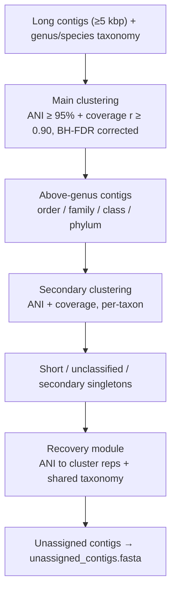

# TriTanc
Taxonomy, ANI and coverage aware metagenomic sequence binner

# Metagenomic Contig Clustering Pipeline

A taxonomy-aware metagenomic contig clustering pipeline that integrates
ANI (Average Nucleotide Identity), coverage correlation, and taxonomic
classification to bin assembled contigs into high-quality genomic clusters.

# Motivation

Metagenomic binning involves processing and grouping the assembled contigs into
genome bins, and forms a foundational step in creating a metagenome-assembled-genomes (MAGs).
Established tools such as MetaBAT2, MaxBin2, VAMB, SemiBin2, and COMEBin predominantly rely 
on two signals: tetranucleotide frequency (TNF) as a proxy for sequence composition, and 
coverage depth across sequencing samples. While effective, TNF-based similarity can conflate 
phylogenetically distinct organisms that share sequence composition biases, 
deep learning approaches require sufficient sample sizes to generalize, and taxonomy is generally
ignored entirely or used as a soft-regularization arm.

I made this to combine the three signals - correlation of coverage from multiple samples, 
taxonomic assignments and average nucleotide identity. Taxonomic assignments acts as hard clustering gate,
and contigs are co-binned if they share a genus or finer assignment to ensure evolutionary coherence. 
ANI provides direct sequence-level evidence of genomic relatedness, and coverage correlation 
confirms that co-binned contigs share the same ecological dynamics across samples.

This three-signal, rule-based architecture is intentionally interpretable: every binning decision 
can be traced to explicit thresholds on measurable quantities, with no black-box model weights 
or training data required. A hierarchical three-pass design: main clustering, secondary clustering for 
above-genus contigs, and a recovery module for short or unclassified sequences which maximizes 
contig placement without sacrificing bin purity. 

Integrated CheckM2 quality assessment and dRep dereplication ensure that the final output 
consists of non-redundant, quality-tiered MAGs ready for downstream pangenomic or ecological analysis.

---

## Time taken to run the script

For the three inputs, the script can take inputs from pre-computed results, or can run the tools 
needed to generate these inputs. For coverage, `jgi_summarize_bam_contig_depths` is used if the BAMs are provided.
For taxonomic information, `mmseqs taxonomy` is run if the relevant input is absent, and 
mmseqs2 compatible database is provided. `skani` is run if needed, and the script will automatically run this.
Time taken for running the different tools here:
`skani` ~ few minutes < `jgi_summarize_bam_contig_depths` ~ take a coffee break < `mmseqs taxonomy` ~ go have lunch

The script is also compatible with the taxometer results from VAMB.

## How It Works

The pipeline proceeds through the following steps:

1. **Taxonomy assignment** - Runs MMseqs2 Taxonomy against a reference database (e.g., GTDB), or accepts a pre-computed taxonomy file (MMseqs2 or Taxometer format)
2. **ANI calculation** — Runs `skani triangle` (all-vs-all) to compute pairwise ANI between contigs
3. **Depth profiling** — Runs `jgi_summarize_bam_contig_depths` on BAM files to build a per-sample coverage matrix
4. **Main clustering** — Clusters long contigs (≥5,000 bp) assigned at genus/species level using ANI ≥ 95% + Spearman coverage correlation ≥ 0.90 (BH-FDR corrected)
5. **Secondary clustering** — Second-pass clustering for above-genus assigned contigs (order/family/class/phylum)
6. **Recovery** — Assigns short and unclassified contigs to existing clusters via ANI hits to cluster representatives and/or shared taxonomy
7. **Quality assessment** — Runs CheckM2 for completeness/contamination estimates
8. **Dereplication** — Runs dRep at 95% ANI to produce a non-redundant bin set
9. **Checkpointing** — Saves intermediate results as Parquet/JSON files to allow resuming interrupted runs

---

## Requirements

### Python

Python **3.10+** is required.

### Python Packages

Replace pip with mamba/conda as you wish. I recommend creating a new environment for this.

```bash
pip install numpy pandas networkx biopython scipy statsmodels pyarrow
```

| Package | Version | Purpose |
|---|---|---|
| `numpy` | ≥1.23 | Vectorized depth matrix operations |
| `pandas` | ≥1.5 | Data I/O and manipulation |
| `networkx` | ≥2.8 | Graph-based connected component clustering |
| `biopython` | ≥1.79 | FASTA parsing and writing |
| `scipy` | ≥1.9 | Spearman correlation |
| `statsmodels` | ≥0.13 | BH-FDR multiple testing correction |
| `pyarrow` | ≥10.0 | Parquet checkpointing |

### External Tools

Install via conda (recommended):

```bash
mamba install -c bioconda mmseqs2 skani metabat2 samtools checkm2 drep vamb
```

| Tool | Required When | Source |
|---|---|---|
| `mmseqs` | `--taxonomy` not provided | [MMseqs2](https://github.com/soedinglab/MMseqs2) |
| `skani` | `--ani` not provided | [skani](https://github.com/bluenote-1577/skani) |
| `jgi_summarize_bam_contig_depths` | `--depth` not provided | Part of MetaBAT2 |
| `samtools` | `--depth` not provided | [HTSlib](https://www.htslib.org) |
| `checkm2` | `--skip-checkm2` not set | [CheckM2](https://github.com/chklovski/CheckM2) |
| `dRep` | `--skip-drep` not set | [dRep](https://github.com/MrOlm/drep) |

---

## Usage

### Fully Automatic (minimum inputs)

```bash
python tritanc.py \
  --fasta assembly.fasta \
  --bams sample1.bam sample2.bam sample3.bam \
  --mmseqs-db /path/to/GTDB \
  --outdir results/
```

### Skip Individual Steps with Pre-computed Files

```bash
python tritanc.py \
  --fasta assembly.fasta \
  --taxonomy saliva_tax.tsv \
  --taxonomy-format taxometer \
  --ani skani.tsv \
  --depth depth_matrix.txt \
  --outdir results/
```

---

## Arguments

### Required

| Argument | Description |
|---|---|
| `--fasta` | Assembly FASTA file containing all contigs |
| `--outdir` | Output directory |

### Step-skipping Inputs

Supplying these pre-computed files skips the corresponding pipeline step:

| Argument | Skips |
|---|---|
| `--taxonomy` | MMseqs2 taxonomy run |
| `--ani` | skani triangle run |
| `--depth` | jgi depth profiling step |

### Conditionally Required

| Argument | Required When |
|---|---|
| `--bams` | `--depth` is not supplied |
| `--mmseqs-db` | `--taxonomy` is not supplied |

### Tunable Parameters

| Argument | Default | Description |
|---|---|---|
| `--threads` | `8` | Threads for MMseqs2 and skani |
| `--min-len` | `5000` | Min contig length (bp) for main clustering |
| `--ani-threshold` | `95.0` | ANI (%) threshold for clustering and recovery |
| `--cov-threshold` | `0.90` | Spearman r threshold for coverage correlation |
| `--min-score` | `0.0` | Taxometer min per-level confidence score (0–1) |
| `--taxonomy-format` | `mmseqs2` | Taxonomy file format: `mmseqs2` or `taxometer` |

### Post-processing

| Argument | Description |
|---|---|
| `--skip-checkm2` | Skip CheckM2 (also skips dRep) |
| `--skip-drep` | Skip dRep dereplication |
| `--checkm2-db` | Path to CheckM2 diamond DB (or set `CHECKM2DB` env variable) |

### Checkpointing

| Argument | Description |
|---|---|
| `--checkpoint-dir` | Directory to store/load intermediate checkpoints (default: `<outdir>/checkpoints/`) |
| `--no-cache` | Ignore existing checkpoints and recompute everything |

---

## Outputs

```
outdir/
├── taxonomy/ # MMseqs2 output (if run)
├── ani/ # skani triangle output (if run)
├── depth/ # jgi depth matrix (if run)
├── clusters/
│ ├── cluster_NNNN_bin.fasta # All contigs in cluster
│ └── cluster_NNNN_representative.fasta # Best representative contig
├── unassigned/
│ └── unassigned_contigs.fasta
├── cluster_summary.tsv # Per-contig assignments + taxonomy + CheckM2 quality
├── checkm2_bin_list.txt # Input list for CheckM2
├── checkm2/ # CheckM2 completeness/contamination results (if run)
├── drep/ # dRep dereplication results (if run)
└── final_bins/ # Symlinks to dereplicated high + medium quality bins
```
---

## Output description

### `cluster_summary.tsv` Columns

| Column | Description |
|---|---|
| `contig` | Contig ID |
| `cluster` | Assigned cluster ID or `unassigned` |
| `is_rep` | Whether this contig is the cluster representative |
| `contig_len` | Contig length (bp) |
| `mean_depth` | Mean coverage depth across samples |
| `rank` | Taxonomic rank of assignment |
| `name` | Taxon name |
| `lineage` | Full lineage (semicolon-delimited) |
| `checkm2_completeness` | CheckM2 completeness (%) |
| `checkm2_contamination` | CheckM2 contamination (%) |
| `checkm2_quality` | `high`, `medium`, `low`, or `not_assessed` |

---

## Quality Thresholds

| Tier | Completeness | Contamination |
|---|---|---|
| High quality | ≥ 90% | ≤ 5% |
| Medium quality | ≥ 50% | ≤ 10% |
| Low (flagged) | < 50% | > 10% |

dRep dereplication is run at **95% ANI** on medium + high quality bins only.

---

## Clustering Logic Summary

